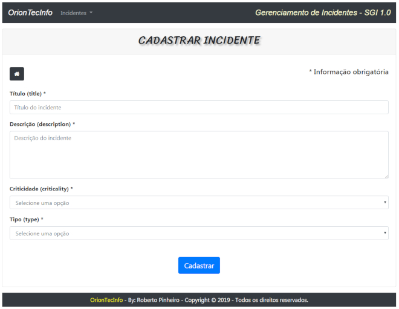
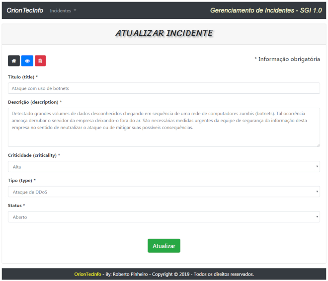
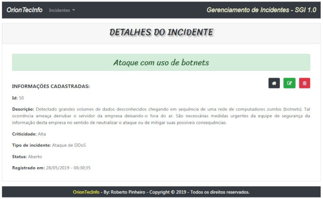

# GERENCIAMENTO DE INCIDENTES

## Sobre

O **SGI** versão 1.0, é um sistema básico de Gerenciamento de Incidentes que permite criar, ler, atualizar e excluir registros de incidentes (**CRUD**). Nesta versão inicial não está incluída um sistema de autenticação de usuários (Login) que será implementado em uma versão futura.

## Características

- Sistema desenvolvido com PHP (versão 7.2.11) orientado a objetos
- Utiliza o framework Laravel versão 5.6
- Arquitetura da aplicação: padrão MVC (Model-View-Controller).
- Utiliza o pacote Laravel Collective versão 5.6.0 para criação de formulários
- Design visual: Utiliza o framework front-end Bootstrap. É responsivo.
- Icones: utiliza o framework Font Awesome Icons

## Download

Inicialmente faça o download dos arquivos em meu [Github](https://github.com/betopinheiro1005/projeto-gerenciamento-incidentes)

## Requisitos

Pacote de serviços integrados (xampp, wamp server, Laragon ou outro qualquer) que contenha:

- Servidor Apache
- PHP
- MySQL
- Ferramenta para administração de bancos de dados (como por exemplo, o phpmyadmin)

## Instalação

1. Crie em seu computador uma pasta com o nome **incidentes** e descompacte os arquivos baixados nessa pasta.
2. Acesse o **phpmyadmin** com:
    - nome de usuário: **root**
    - senha: 

    **OBS**: Use senha em branco.

3. Crie um banco de dados com o nome ***incidentes***.
4. Importe o arquivo  **incidentes.sql** (disponível nos arquivos baixados). Será automaticamente criada a tabela do sistema populada com 50 registros de teste.

## Uso

Para testar o aplicativo inicie o servidor local (Apache) e o MySQL. Em seguida, utilizando um navegador como o Google Chrome ou Firefox, entre com a seguinte URL:

> `http://localhost/incidentes/public/`

## Screenshots

> `http://localhost/incidentes/public/incidents`

 

> `http://localhost/incidentes/public/incidents/create`

 

> `http://localhost/incidentes/public/incidents/50/edit`

 

> `http://localhost/incidentes/public/incidents/50`

 

> `http://localhost/incidentes/public/incidents/50/destroy`

