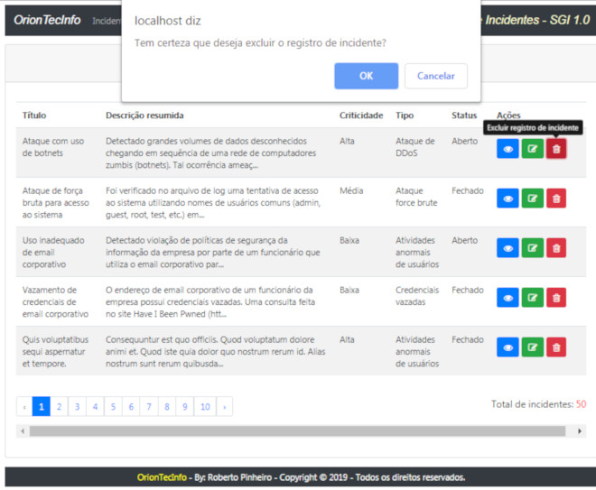

# GERENCIAMENTO DE INCIDENTES

## About

O **SGI** versão 1.0, é um sistema básico de Gerenciamento de Incidentes que permite criar, ler, atualizar e excluir registros de incidentes (**CRUD**). Nesta versão inicial não está incluída um sistema de autenticação de usuários (Login) que será implementado em uma versão futura.

## Características

- Sistema desenvolvido com o PHP e o framework Laravel 5.6
- Arquitetura da aplicação: padrão MVC (Model-View-Controller).
- Design visual: Utiliza o framework front-end Bootstrap e é responsivo.

## Download

Inicialmente faça o download dos arquivos em meu [Github](https://github.com/betopinheiro1005/projeto-gerenciamento-incidentes)

## Requisitos

- Sistema gerenciador de banco de dados MySQL
- Servidor Apache

## Instalação e Uso

1. Crie em seu computador uma pasta com o nome **incidentes** (ou qualquer outro nome) e descompacte os arquivos baixados nessa pasta.
2. Crie um banco de dados com o nome ***incidentes***.
3. A criação automática da tabela populada com 50 registros de teste, pode ser realizada com uma ferramenta para administração de banco de dados MySQL, como por exemplo o **phpmyadmin**. Nesse caso acesse-o com:
    - nome de usuário: **root**
    - senha: 
4. ***OBS***: Deixar a senha em branco.
5. Em seguida, faça a importação do arquivo **incidentes.sql** (disponível nos arquivos baixados).
6. Para testar o aplicativo, Utilize um servidor local (por exemplo, o Apache) disponível em pacotes integrados como o XAMPP, WAMP, Laragon ou qualquer outro de sua preferência.
7. De start no Apache (servidor local) e no MySQL.Em seguida, utilizando um navegador como o Google Chrome ou Firefox, entre com a seguinte URL:
`http://localhost/incidentes/public/`

## Screenshots

`http://localhost/incidentes/public/incidents/`

`http://localhost/incidentes/public/incidents/create`

`http://localhost/incidentes/public/incidents/50/edit`

`http://localhost/incidentes/public/incidents/50/destroy`

